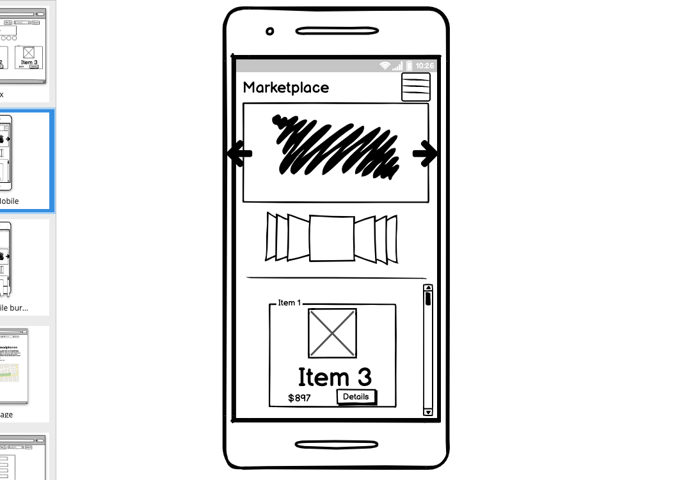

# Group-Project

Using the following as a [brief](Brief.md), we as a group decided to create a secondhand market place as the theme and framing for the app.

Try and Explore around
[Marketplace](https://jbemarketplace.herokuapp.com/marketplace)

Use these credentials to browse out app

Sample account:
 
username : 1234
 
password : 1234

## Collaborators

- [Bailey](https://github.com/bdeacon2001)
- [Johnson](https://github.com/Johnson-MintyC)
- [Ethan](https://github.com/EthanGaoo)

## Stacks Used

- MongoDB
   
  
- Express

- React
   
  
- Node JS
   
  
- JavaScript
   
  
- Heroku
   
  
- Cloudinary
   
  

## Features

## Approach

We tackled the backend first, as the main backend functionality of a MERN CRUD app is similar, such as the express server logic and the react routes that would interact with the express CRUD routes.
 
Majority of this project was done via pair coding with input and suggestions, with task assignment and communication through slack

## Installation dependencies

This app requires external api keys from the following

- Google Cloud
- Cloudinary
- Mongo DB

## Unresolved Issues

Theres no way to contact the poster, potential sketch goal is a messaging system Route that can belong to the user,
The CSS can be futher fine tuned, as theres mismatches in sizing

## Wireframe

We used Balsamiq as out wireframing tool

click to see the drawing board beginnings for our app

[Wireframe](https://balsamiq.cloud/sf7g98b/p51djqu)

